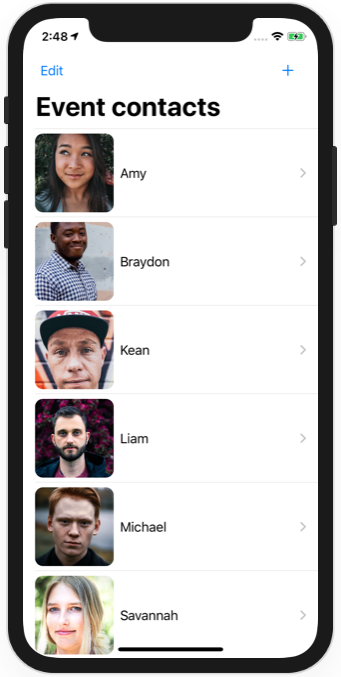
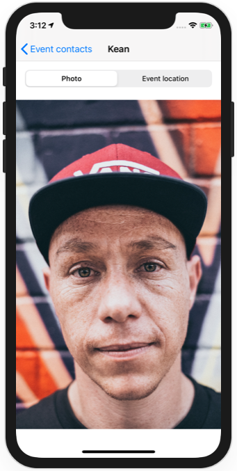
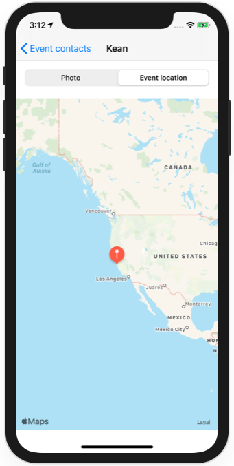
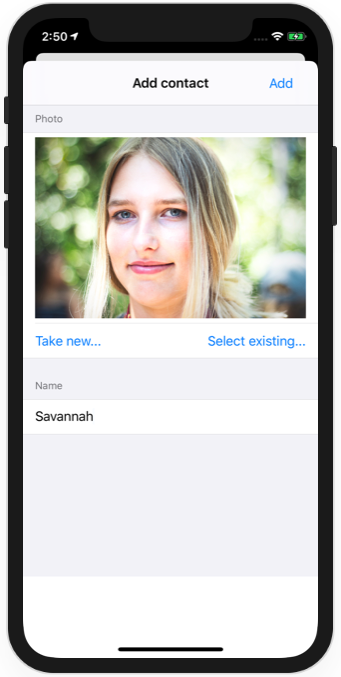

# Realm SwiftUI Demo

A way of using *Realm* to persist data in a SwiftUI project.

This builds on one of the projects from "100 days of SwiftUI" (original [here](https://github.com/clarknt/100-days-of-swiftui/tree/master/21-Milestone-Projects13-15)), by adding *Realm* persistence to the previously available *File* and *CoreData*.

To switch between persistence implementations, inject one of those in `SceneDelegate.swift`: `FilePersons()`, `CoreDataPersons()` or `RealmPersons()`.
  
#### Note

Swift Package Manager initial retrieval of Realm can be a bit slow.

#### Credits

Photos by [Austin Wade](https://unsplash.com/@austin_wade?utm_source=unsplash&utm_medium=referral&utm_content=creditCopyText), [Daniel Höhe](https://unsplash.com/@beyondxphotography?utm_source=unsplash&utm_medium=referral&utm_content=creditCopyText),  [Nathaniel Vala](https://unsplash.com/@spydernaz?utm_source=unsplash&utm_medium=referral&utm_content=creditCopyText), [David Rotimi](https://unsplash.com/@davidrotimi?utm_source=unsplash&utm_medium=referral&utm_content=creditCopyText), [Johan De Jager](https://unsplash.com/@vividd?utm_source=unsplash&utm_medium=referral&utm_content=creditCopyText), [Anastasia Vityukova](https://unsplash.com/@anastasiavitph?utm_source=unsplash&utm_medium=referral&utm_content=creditCopyText) on [Unsplash](https://unsplash.com/collections/9256441/faces-full-neutral-suitable-for-auto-gen?utm_source=unsplash&utm_medium=referral&utm_content=creditCopyText)

## Screenshots

